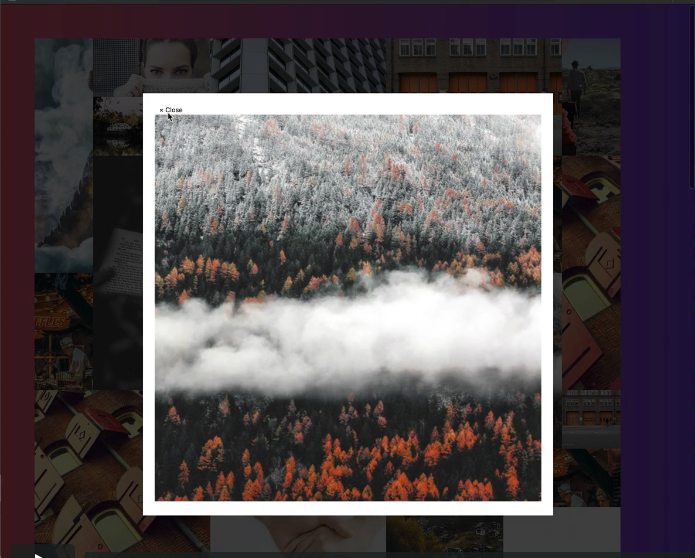

# Image Gallery, based on video #20 of Wes Bos CSS Grid course

### What is this about?

- the project is based on coding along to video number 20 of Wes Bos CSS Grid course (for which you can sign up for free)
- HTML, CSS, JavaScript and here obviously CSS Grid
- as I've started to tweak the original Wes Bos code, mine looks different already
- the (my) main navigation has no functionality, it's in there for future, possible improvements

### This Repo is based on:

- [Wes Bos course video number 20 - Image Gallery](https://courses.wesbos.com/account/access/5aeb2ed1477d322f9967f8fd/view/249560994)
- [Wes Bos Image Gallery code on GitHub](https://github.com/wesbos/css-grid/tree/master/20%20-%20CSS%20Grid%20Image%20Gallery)
- [Wes Bos complete CSS Grid course](https://cssgrid.io/)
- [Wes Bos courses in general](https://wesbos.com/courses)

### How to run this?

- clone this project
- cd into project
- open `index.html` in your browser of choice (in my case, built in/for Chrome)

### Screenshots of what Wes Bos created during his course

- basic page with image gallery
- on hover, transparent, yellow item overlay, with "view" button
  
- after button click, overlay box, which shows the whole image
- close button
  

## Personal Expectation Management towards the course

- better understanding of CSS Grid
- better understanding on what (not) to use if you want to build a masonry without fixed "image placeholders"

### PRO

- I liked how he auto-generates the images on the page via JavaScript, and have them refreshed via reload
- I also kinda liked the transitioning item-overlay, even though I did not get it to work how he got it to work

### CON

- not mobile first
- due to fixed image sizes only halfway properly displayed images, depending on (pixel width of) view
